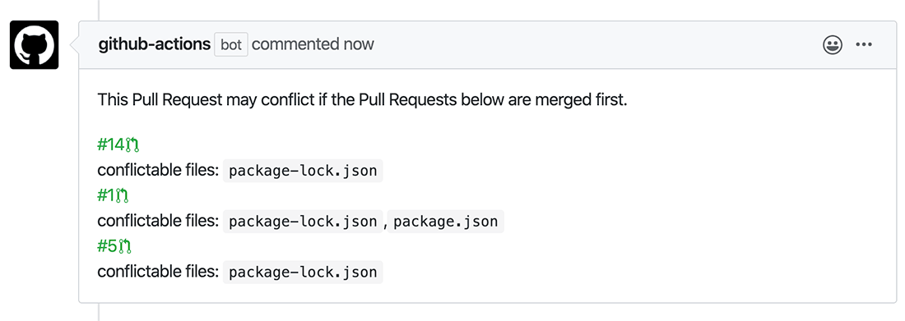

potential-conflicts-checker-action
-------------

When pull requests are created or updated, this action compare all other
pull requests and then leaves comments on the pull requests
if same files are changed, and there is any possibility to be conflicted
when other pull requests merged first.



## Usage
You can create a `.github/workflows/pr-conflicts.yml` file:

```
name: check potential conflicts
on: pull_request

jobs:
  build:
    name: potential-conflicts-checker
    runs-on: ubuntu-latest
    steps:
      - uses: outsideris/potential-conflicts-checker-action@0.1.0
        with:
          ghToken: ${{ secrets.GITHUB_TOKEN }}
```

This will trigger the action when a pull request is opened or updated.
You'll need to include the `ghToken` environment variable!

## License
Licensed under the [MIT license](https://github.com/outsideris/potential-conflicts-checker-action/blob/master/LICENSE).
